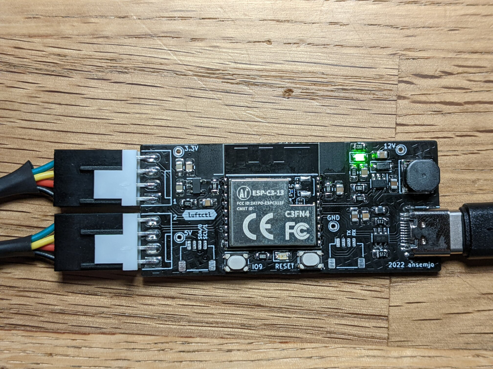
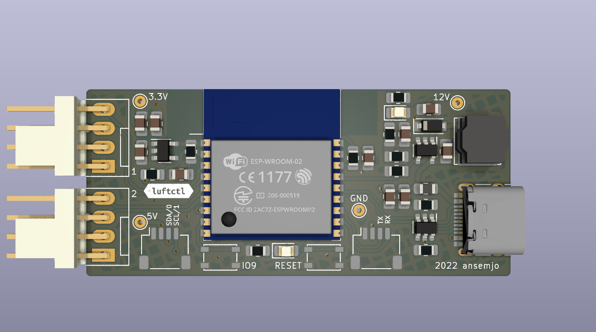
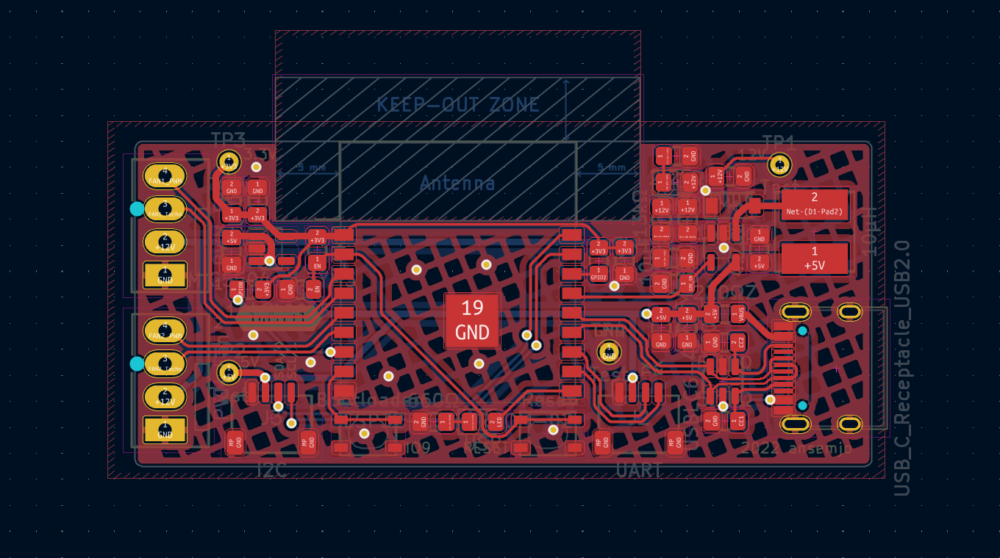
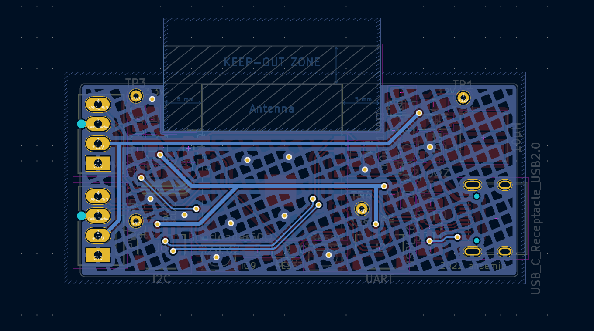

# luftctl

Small ESP32-C3 [controller board](schematic.pdf) to power two PWM fans from a single USB plug.

## hardware

Schematic and PCB design can be found in [`hardware/`](hardware/). It is a KiCAD 6 project.

## firmware

The first simple test just loops through {`12v on`, `pwm on`, `12v off`, `pwm off`}.

Download MicroPython from [micropython.org/download/esp32c3-usb/](https://micropython.org/download/esp32c3-usb/) and flash it with:

```
esptool.py --chip esp32c3 --port /dev/ttyACM0 erase_flash
esptool.py --chip esp32c3 --port /dev/ttyACM0 --baud 460800 write_flash -z 0x0 esp32c3-*.bin
```

Then install a virtualenv with `adafruit-ampy` and upload the [`main.py`](main.py):

```
ampy -p /dev/ttyACM0 put main.py
ampy -p /dev/ttyACM0 reset --hard
```

The red LED will blink upon every phase change.

## images








